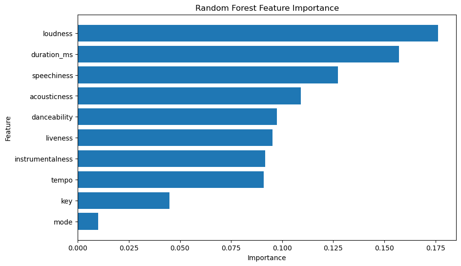
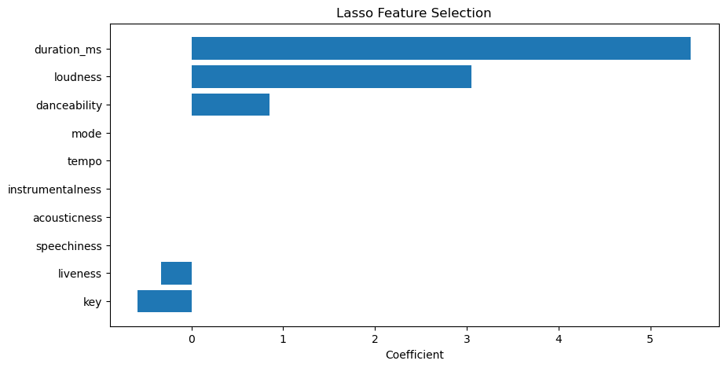
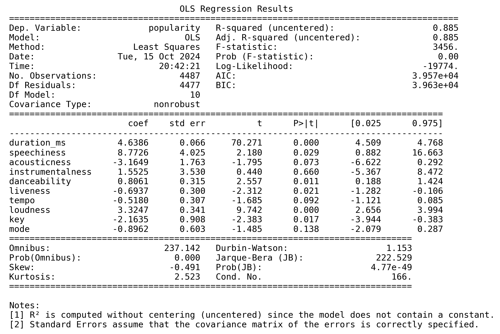

# eco395m_midterm_project


## A.Data Collection(ly)
***Source:*** 
  We used the Spotify for Developers API to gather information on Spotify music. Here are the links to the docomentation of Spotify for Developers: https://developer.spotify.com/documentation/web-api.


***Process:***
* *Search for Playlists:*  
  We utilized Spotify's Search API (https://developer.spotify.com/documentation/web-api/reference/search)
  to search for playlists containing English songs. By setting the query to "English songs,"  
  we ensured that the data would be diverse and representative of different music genres.  
  We retrieved 50 playlists in total.
  This step is handled in `code/data/get_playlists.py`.
  
* *Retrieve Playlist Items:*  
  Using the Get Playlist Items API (https://developer.spotify.com/documentation/web-api/reference/get-playlists-tracks),  
  we extracted all the songs from these 50 playlists. This allowed us to gather basic information for each song,  
  such as ID, name, release date, artists, popularity, and more. This process resulted in an initial dataset containing 5,668 tracks.
  This step is handled in `code/data/get_tracks.py`.

* *Extract Audio Features:*  
  With the track IDs obtained from the previous step, we then used the Get Track's Audio Features API (https://developer.spotify.com/documentation/web-api/reference/get-audio-features)  
  to retrieve detailed audio features for each track. These features included attributes such as loudness, energy, danceability, and more,  
  providing a deeper understanding of the songs' characteristics. After dropping the duplicated data,  
  the dataset contains data on 4,929 tracks. We saved the data into a CSV file named `spotify_data.csv`.
  This step is handled in `code/data/get_spotify_data.py`.


***Execution method:*** 
  To execute the code and get the tracks' information and audio featires (the data that you can use for further analysis), you should first get a Spotify API Client ID and Client Secret. Please follow the steps below to obtain them. Then set them as environment variables, and our code in get_spotify_data.py can help you get your access token. The steps are as follows: 

* Go to the Spotify for Developers Dashboard (https://developer.spotify.com/dashboard/) and log in or create a Spotify developer account.
* Create a new application, and you will receive a Client ID and Client Secret.
* Execute the following commands in the terminal:
```bash
git clone git@github.com:ClaireLu0608/eco395m_midterm_project.git
cd eco395m_midterm_project
pip install -r requirements.txt
cd code
cd data
```
* Set your Client ID and Client Secret in the `.env` file. Then you can run codes in `get_spotify_data.py` and produce your own data.
```bash
python3 get_spotify_data.py
```

***Results you will get:*** 
  A CSV file named `spotify_data.csv`, [here](artifacts/spotify_data.csv).

## B.Data Overview(zty)
### documentation
1. id: The Spotify ID for the album
2. name:The name of the album
3. release date:The date the album was first released
4. artists: The artists of the album
5. duration (ms):The track length in milliseconds
6. popularity:The popularity of the track. The value will be between 0 and 100.
7. preview url:A link to a 30 second preview (MP3 format) of the track. Can be null
8. danceability:Danceability describes how suitable a track is for dancing based on a combination of musical elements including tempo, rhythm stability, beat strength, and overall regularity. A value of 0.0 is least danceable and 1.0 is most danceable.
9. energy:Energy is a measure from 0.0 to 1.0 and represents a perceptual measure of intensity and activity.
10. key:The key the track is in. Integers map to pitches using standard Pitch Class notation. E.g. 0 = C, 1 = C♯/D♭, 2 = D, and so on. If no key was detected, the value is -1.
11. loudness:The overall loudness of a track in decibels (dB).
12. mode:Mode indicates the modality (major or minor) of a track, the type of scale from which its melodic content is derived. Major is represented by 1 and minor is 0.
13. speechiness:Speechiness detects the presence of spoken words in a track.
14. acousticness:A confidence measure from 0.0 to 1.0 of whether the track is acoustic. 
15. instrumentalness:Predicts whether a track contains no vocals.
16. liveness:Detects the presence of an audience in the recording.
17. valence:A measure from 0.0 to 1.0 describing the musical positiveness conveyed by a track.
18. tempo:The overall estimated tempo of a track in beats per minute (BPM). In musical terminology, tempo is the speed or pace of a given piece and derives directly from the average beat duration.


### distribution


1. The distribution of duration(ms), danceability, energy, loudness, liveness,valence and tempo are more closely follows a normal distribution
2. **Duration:**
The distribution of duration shows a somewhat unimodal pattern with most songs having durations between 200,000 and 400,000 milliseconds (or roughly 3 to 6 minutes). The peak occurs around 300,000 ms (5 minutes).
3. **Danceability:**
Danceability appears to have a normal distribution, centered around 0.6. This suggests that most songs have moderate danceability, with fewer songs on the extreme ends (low or high).
4. **Energy:**
The energy feature follows a right-skewed distribution, with a large number of songs having energy levels between 0.6 and 0.8. This suggests that many songs have relatively high energy.
5. **Key:**
The distribution of key shows a somewhat uniform pattern, meaning songs are evenly spread across different keys, though certain keys appear more frequently than others.
6. **Loudness:**
Loudness has a left-skewed distribution, with most songs clustered between -10 dB and 0 dB, indicating relatively high loudness for the majority of the tracks.
7. **Mode:**
The number of songs have mode 1 is more than songs which have mode 0.
8. **Speechiness:**
Speechiness is heavily skewed to the left, meaning most songs have very low speech content. Only a few songs show higher speechiness values.
9. **Acousticness:**
Many songs having very low acoustic characteristics. This indicates that most songs are electronically produced.
10. **Instrumentalness:**
Most songs include vocals and are not purely instrumental.
11. **Liveness:**
Most songs have a low live performance aspect, though a small number of songs feature higher liveness values, possibly indicating live recordings.
12. **Valence:**
Valence is fairly evenly distributed, with songs spread across the full range of valence from 0 to 1, though there is a slight peak around 0.5, indicating that many songs have a neutral emotional tone.
13. **Tempo:**
The tempo distribution is multimodal, with several peaks indicating that songs tend to cluster around certain common tempo ranges (such as 60-75 bpm, 120-140 bpm).
14. **Year:**
The distribution of the release year shows a steep rise from the 1960s onwards, with a noticeable peak around 2020. This suggests that the dataset contains a larger number of recent tracks.

 
## C.Data Cleaning(xlb) and Correlation(zty)


### Correlation

## D.Models(xlb)
***Variables:*** 
  From previous correlation results, we have left with duration_ms, speechiness, acousticness, instrumentalness, danceability, liveness, loudness, tempo, key, and mode as are features and popularity as our y label. "Mode" is the only binary variable and all other variables are continous.

***Data Cleaning:*** 
  For model interpretation and to avoid overfitting, we excluded data points with a popularity score below 5. We applied three different data transformation methods: Log Transformation for skewed features, Standard Scaling for features that followed a normal distribution, and Min-Max Scaling for features without an obvious distribution pattern. The cleaned version is in a csv file [here](artifacts/cleaned_data.csv) in the artifacts folder by running the following command:
```bash
python code/cleaning/data_cleaning.py
```

***Models:*** 
  To explore which features are more relevant and influential to the popularity score, we used three models for feature selection.
* *Random Forest:*
  We used impurity-based feature importance from the Random Forest model to identify which features contributed the most to reducing impurity when splitting the data at various nodes. A 5-fold cross-validation was conducted on the training data to select the best parameters, which were then used to fit the model and obtain the feature importance scores. The results below are displayed in descending order of importance.
  
* *Lasso Regression:*
  We also utilized Lasso regression for feature selection, as it shrinks some variable coefficients to 0 by adding a penalty term to the loss function. A 5-fold cross-validation was performed on the training data to select the optimal alpha from a range of values. We then obtained the coefficients from the optimal model. The results below show the selected features in color and the unselected features with coefficients of 0
  
* *OlS Regression:*
  Lastly, we employed OLS regression to obtain the estimated coefficients. Using the OLS regression function from the Statsmodels package allowed us to perform statistical inference, such as calculating p-values for the coefficients, which helped identify influential features. The summary of the OLS regression fitting is shown below.
  

***Results:*** 
  We concluded that Mode, Tempo, instrumentalness, and acoutisticness are the less influential features to popularity score, since at least two of the three models excluded them from the subset of important features. 

***Execution method:*** 
```bash
python code/models/random_forest_feature_importance.py
```
* After running the above command in the terminal, you will get the above image results in the images folder. Random Forest and Lasso will also return resulting Mean Square Error on testing data.
* Remember to change the name of the Python file to the method you want to use.


## E.Case Study(czz)

## F.Reproducibility(ly)
* ***Data:*** You can follow the guidance in **Part A**. Please note that you need to have the Client ID and Client Secret first. 
* 
## G.Limitations (all)

## H.Further Improvements(all)


